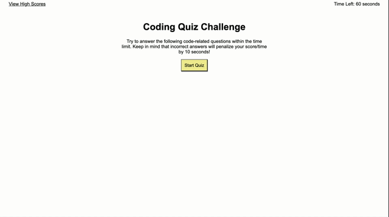

# jordyn-mancini-homework4-API-code-quiz

## The Objective

Using HTML, CSS, and Javascript, I have created a timed coding quiz with multiple-choice questions. When the user answers questions correctly their score goes up, and when they get a question wrong time is taken away from the timer. After they have answered all questions, their final score is shown and they are given the option to enter their Initials & score into the highscore list. This entry is saved into Local Storage until it is cleared. 

## The Process

The HTML contains multiple sections - including a question container, intro container, end screen container, and highscores page container. These sections are revealed and hidden by adding and removing a class of "hide." When the user selects "Start Quiz," the first question is revealed and the timer begins to count down from 60. When the user selects an answer, the next question is revealed. Based on which answer the user selects, the screen will show "correct!" or "wrong!" underneath the question container. 

On the Highscores Page, the user has the choice to select "Go Back" or "Clear Highscores." If they click "Go Back," they will be brought to the beginning of the quiz and the timer will reset. "Clear Highscores" will empty the list of highscores shown on the screen as well as the Local Storage. 

## Link to Deployed Project 

 https://jordynnmancini.github.io/jordyn-mancini-homework4-API-code-quiz/ 

## Demonstration 

As you can see from the demonstration, there are a few bugs that I was not able to work out. If you click "clear Highscores" and then click on "View Highscores," the scores that were supposed to be cleared will show up. Also, if you click "View Highscores" when you are on the Highscores page, the list will render again. Besides that, it is working as expected. 

